

# vgmu Gallery

A visual tour of vgmu's interface, screen by screen.

**[Welcome Screen](#welcome-screen) · [Home Tab](#home-tab) · [Search](#search) · [Library](#library) · [Album Pages](#album-pages) · [Playback](#playback) · [Downloads](#downloads) · [Settings and Themes](#settings-and-themes) · [Discord](#discord)**

---

## Welcome Screen

<b>The first thing you see on launch — no account, no sign-up, straight into the app.</b>

<table><tr>
<td align="center" width="280">
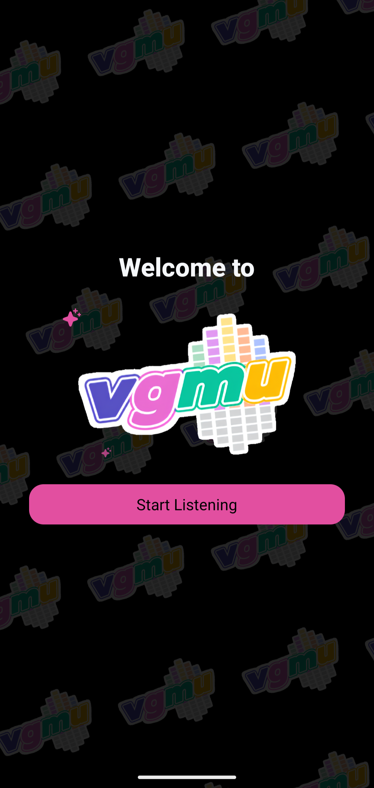 
<b>Figure 1 — Welcome to vgmu</b> The first-time launch screen: a tiled logo backdrop behind the vgmu wordmark and a single "Start Listening" call to action.
</td>
</tr></table>

<a href="#vgmu-gallery">↑ back to top</a>

---

## Home Tab

<b>Where every session starts: curated picks from the online catalog and one-tap presets for quick discovery.</b>

<table><tr>
<td align="center" width="280">
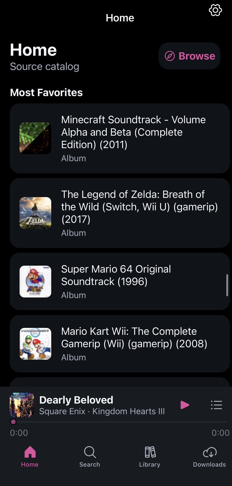 
<b>Figure 2 — Discover, Most Favorites</b> The Home feed's curated row, surfacing popular soundtracks like <i>Minecraft</i>, <i>Zelda: Breath of the Wild</i>, <i>Super Mario 64</i>, and <i>Mario Kart Wii</i>, with a pinned mini-player for <i>Kingdom Hearts III</i>.
</td>
<td align="center" width="280">
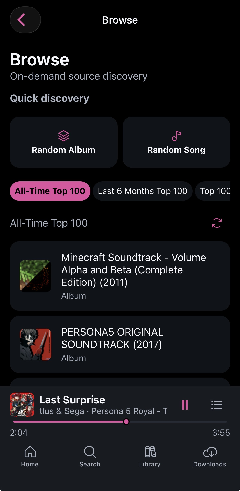 
<b>Figure 3 — Browse, All-Time Top 100</b> On-demand discovery: Random Album / Random Song shortcuts up top, with the All-Time Top 100 preset ranking <i>Minecraft</i> and <i>Persona 5</i>.
</td>
</tr></table>

<a href="#vgmu-gallery">↑ back to top</a>

---

## Search

<table><tr>
<td align="center" width="280">
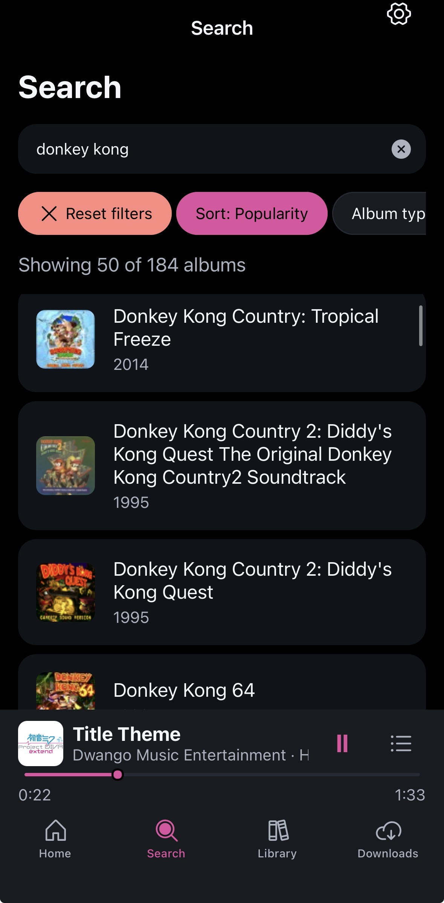 
<b>Figure 4 — "donkey kong," sorted by Popularity</b> 184 matching albums, with Reset Filters and Album Type chips above the results.
</td>
<td align="center" width="280">
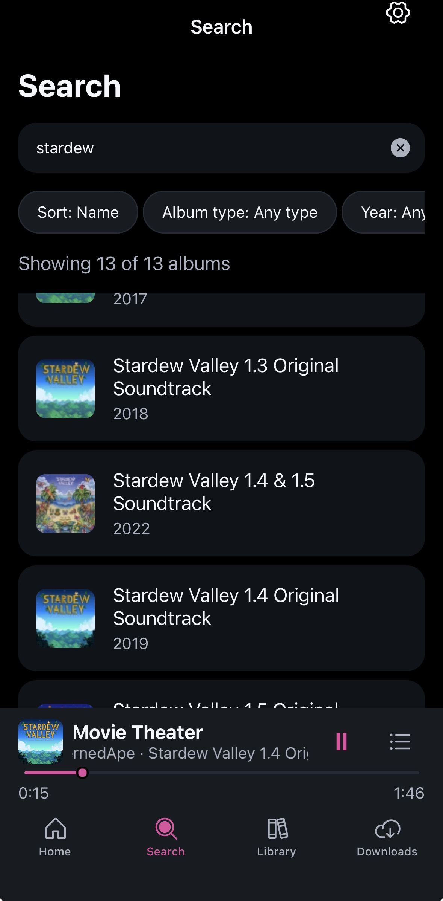 
<b>Figure 5 — "stardew," sorted by Name</b> All 13 Stardew Valley soundtrack releases, sorted alphabetically with Album Type and Year filters.
</td>
</tr></table>

<b>Search by album/soundtrack title with Sort, Album Type, Year, and Platform filters, plus paginated infinite-scroll results with a live count.</b>

<a href="#vgmu-gallery">↑ back to top</a>

---

## Library

<table><tr>
<td align="center" width="280">
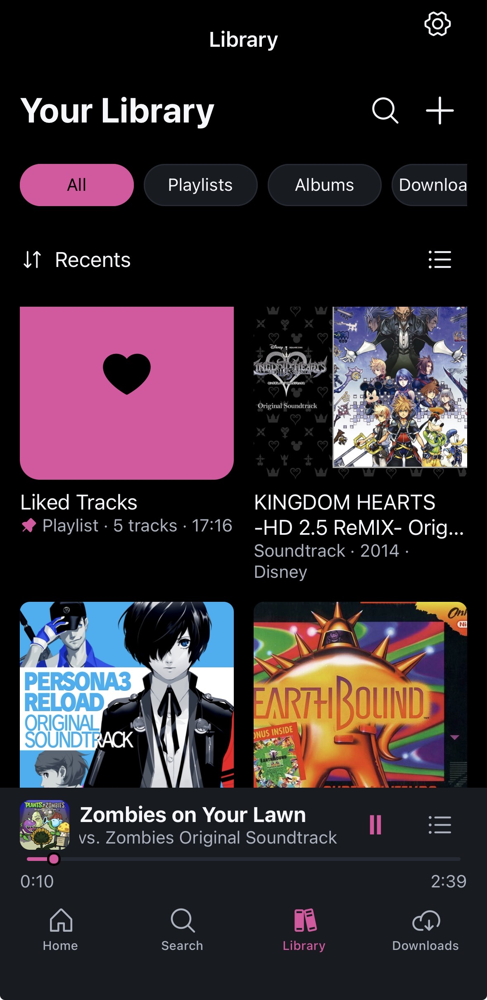 
<b>Figure 6 — Library overview</b> The "All" tab's Recents: a pinned Liked Tracks playlist plus saved albums for <i>Kingdom Hearts -HD 2.5 ReMIX-</i>, <i>Persona 3 Reload</i>, and <i>EarthBound</i>.
</td>
<td align="center" width="280">
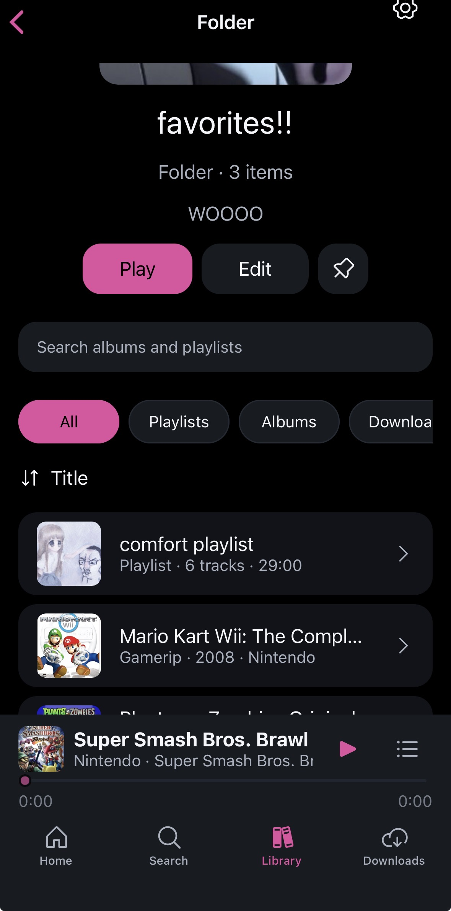 
<b>Figure 7 — Folder, "favorites!!"</b> A user-created folder grouping a playlist and an album, with a custom description and Play/Edit/Pin actions.
</td>
<td align="center" width="280">
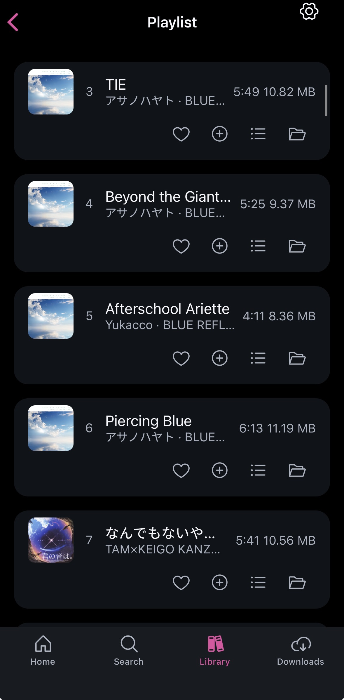 
<b>Figure 8 — Playlist track list</b> A <i>BLUE REFLECTION</i> playlist, with per-track like, queue, add-to-playlist, and reveal-in-folder actions.
</td>
</tr></table>

<table><tr>
<td align="center" width="280">
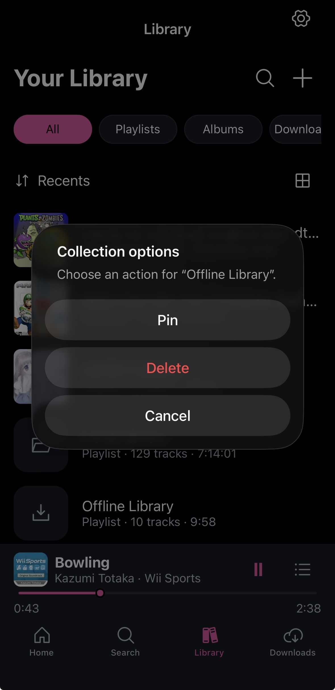 
<b>Figure 9 — Offline Library, options</b> The auto-generated Offline Library collection (10 downloaded tracks), with Pin/Delete/Cancel.
</td>
<td align="center" width="280">
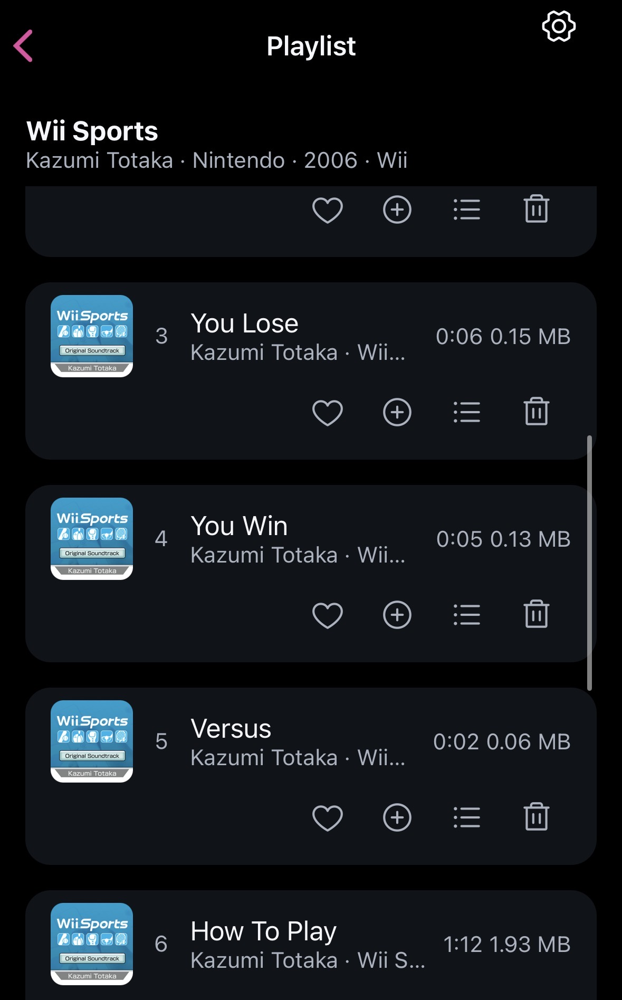 
<b>Figure 10 — Offline Library, tracks</b> Downloaded <i>Wii Sports</i> tracks with a delete action in place of download, since they're already on-device.
</td>
<td align="center" width="280">
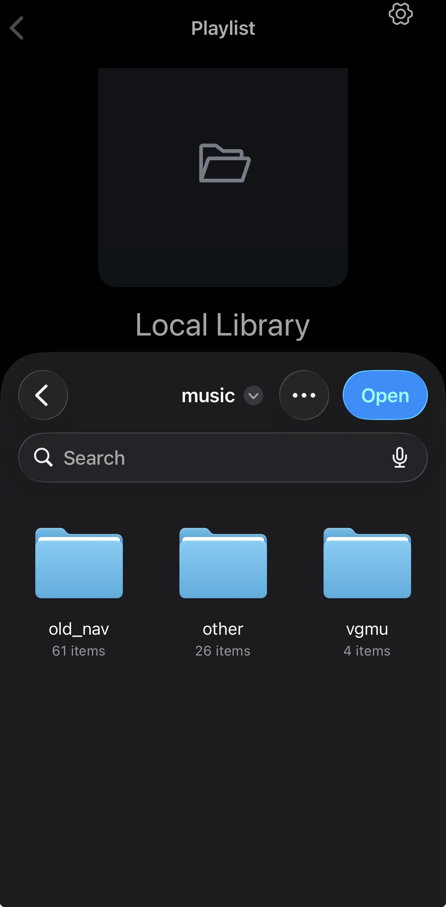 
<b>Figure 11 — Local Library, file picker</b> Importing audio straight from the device's file system via the native document picker.
</td>
</tr></table>

<table><tr>
<td align="center" width="280">
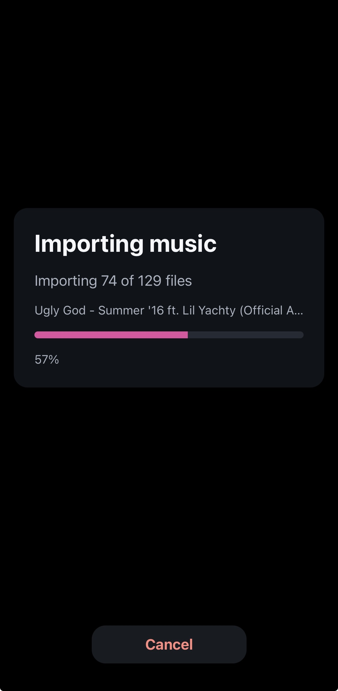 
<b>Figure 12 — Local Library, import progress</b> Batch-importing 129 local files with a live per-file progress bar.
</td>
<td align="center" width="280">
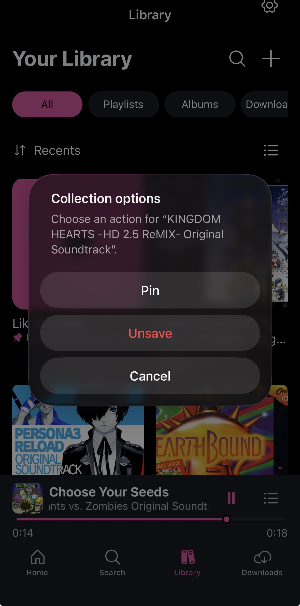 
<b>Figure 13 — Collection options</b> Long-press menu on a saved album: Pin, Unsave, or Cancel.
</td>
<td align="center" width="280">
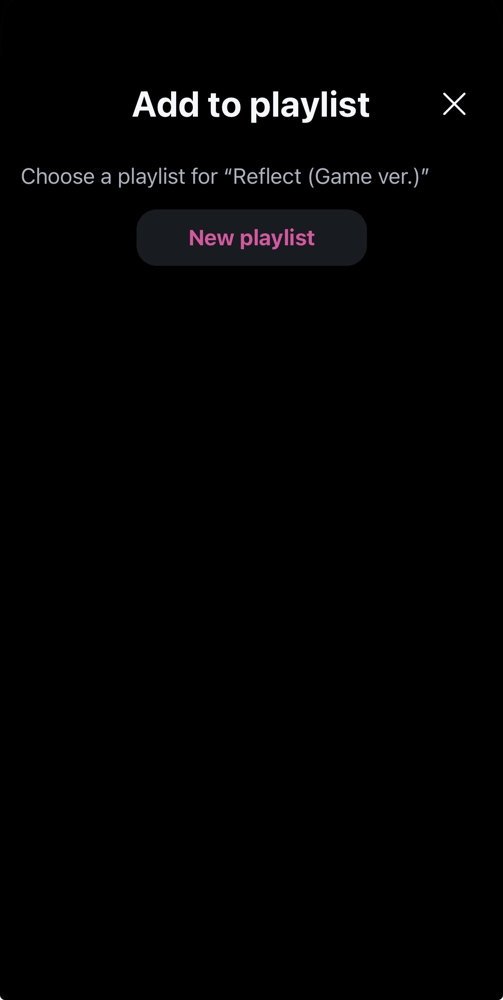 
<b>Figure 14 — Add to playlist</b> Choosing a destination playlist for a track, with a shortcut to start a new one.
</td>
</tr></table>

<table><tr>
<td align="center" width="280">
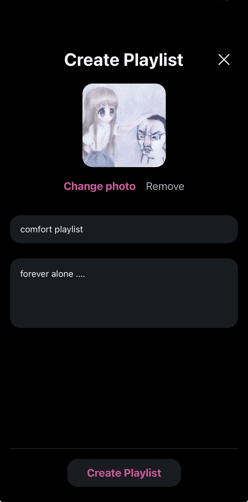 
<b>Figure 15 — Create Playlist</b> Naming a new playlist with custom artwork and a description.
</td>
<td align="center" width="280">
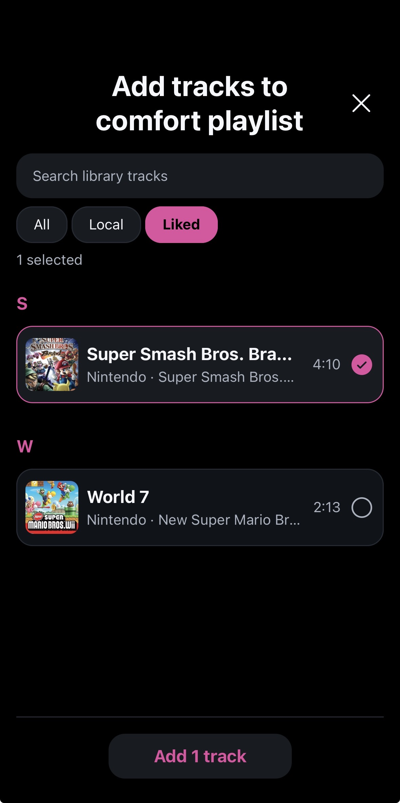 
<b>Figure 16 — Add tracks to a playlist</b> Picking tracks from All/Local/Liked filtered library views.
</td>
<td align="center" width="280"></td>
</tr></table>

<b>Saved albums (any album with at least one library track), filter chips, and sort/view toggles round out collection management.</b>

<a href="#vgmu-gallery">↑ back to top</a>

---

## Album Pages

<b>Every album's home base: play the whole thing, save it, download it, or dig into individual tracks and artwork.</b>

<table><tr>
<td align="center" width="280">
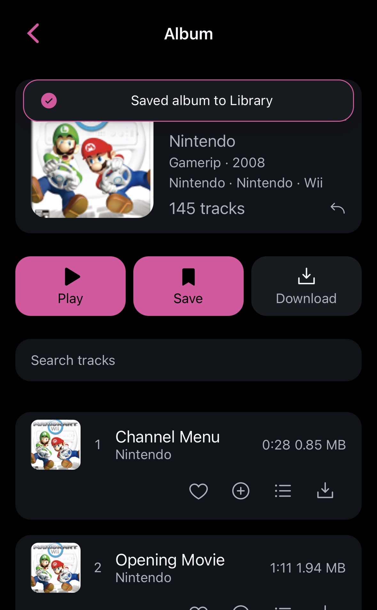 
<b>Figure 17 — Mario Kart Wii</b> Play, Save, and Download actions on a 145-track album, with a "Saved album to Library" confirmation.
</td>
<td align="center" width="280">
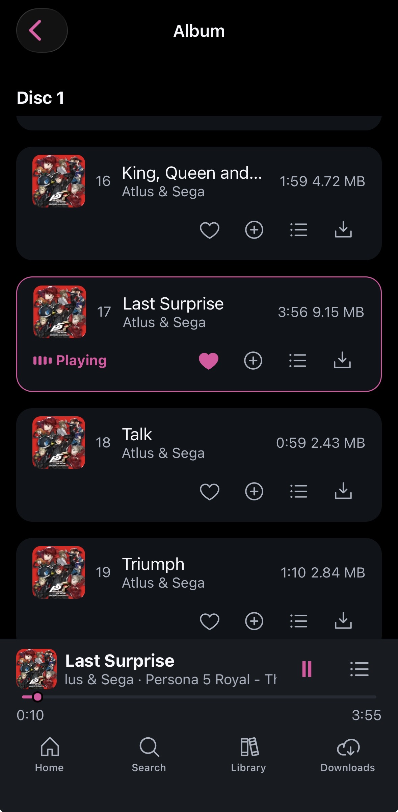 
<b>Figure 18 — Persona 5 Royal</b> The disc listing with "Last Surprise" actively playing and liked, alongside per-track actions.
</td>
<td align="center" width="280">
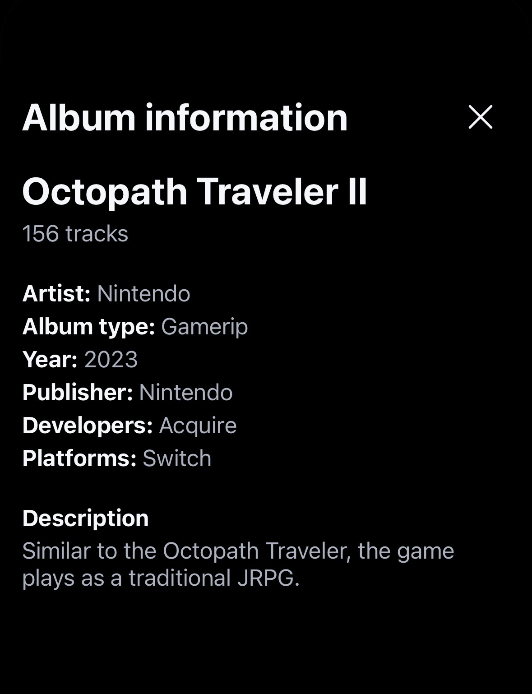 
<b>Figure 19 — Album information, Octopath Traveler II</b> Extended metadata: artist, type, year, publisher, developers, platforms, and description.
</td>
</tr></table>

<table><tr>
<td align="center" width="280">
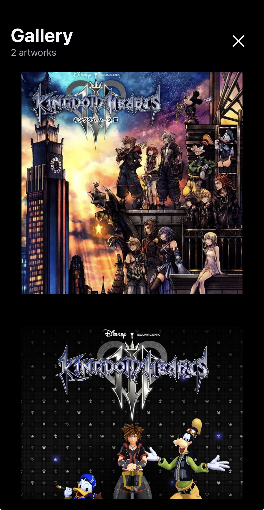 
<b>Figure 20 — Artwork gallery, Kingdom Hearts III</b> Browsing alternate cover art and logo variants pulled from the catalog.
</td>
<td align="center" width="280">
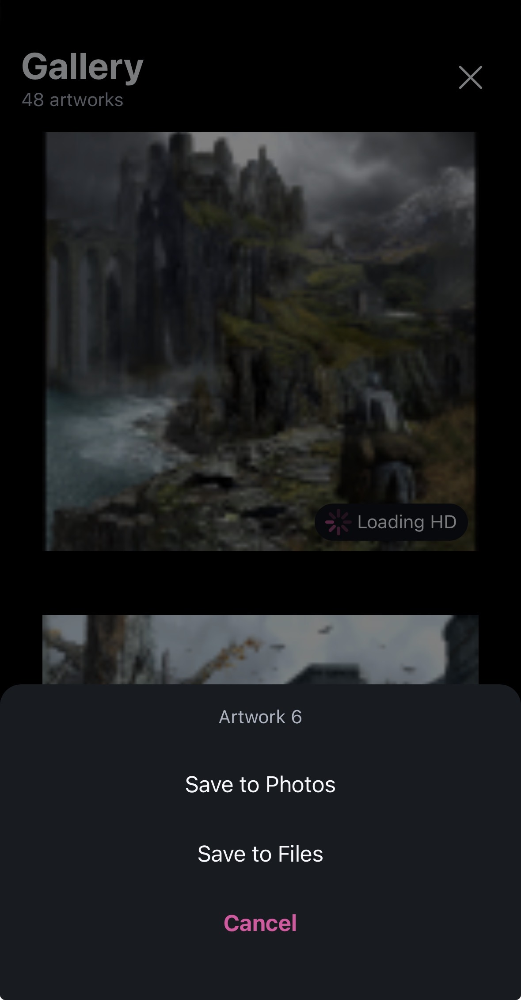 
<b>Figure 21 — Artwork gallery, save options</b> Saving high-resolution artwork to Photos or Files from a 48-image gallery.
</td>
<td align="center" width="280"></td>
</tr></table>

<a href="#vgmu-gallery">↑ back to top</a>

---

## Playback

<table><tr>
<td align="center" width="280">
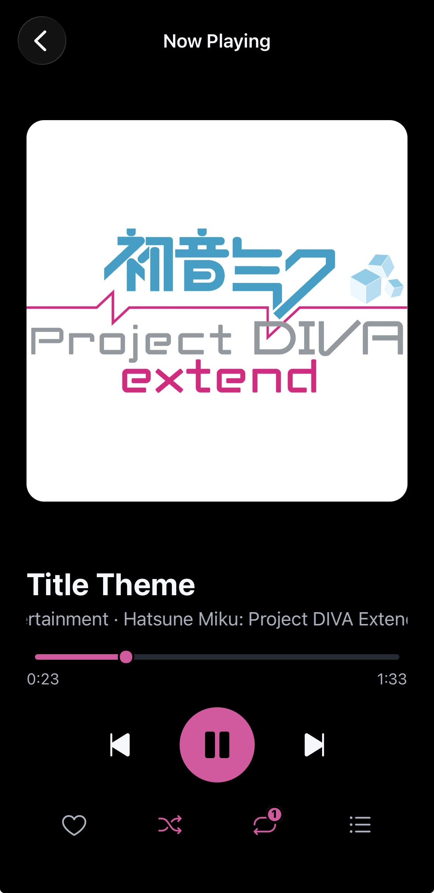 
<b>Figure 22 — Project DIVA Extend</b> "Title Theme" with repeat-one enabled.
</td>
<td align="center" width="280">
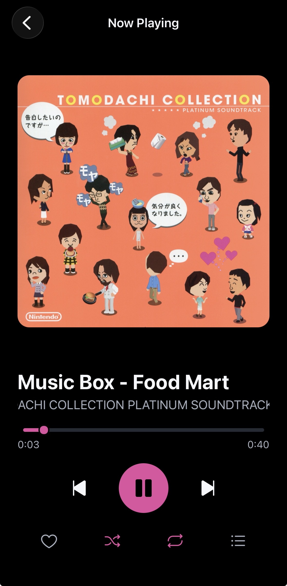 
<b>Figure 23 — Tomodachi Collection</b> "Music Box - Food Mart" from the Platinum Soundtrack.
</td>
<td align="center" width="280">
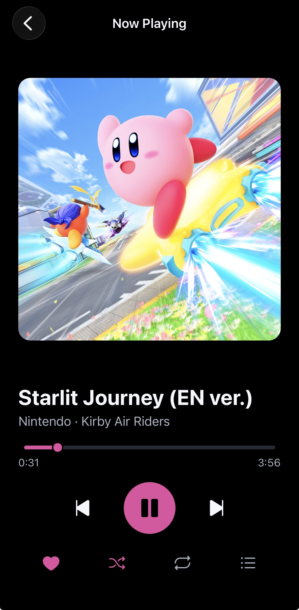 
<b>Figure 24 — Kirby Air Riders</b> "Starlit Journey (EN ver.)," liked and mid-playback.
</td>
<td align="center" width="280">
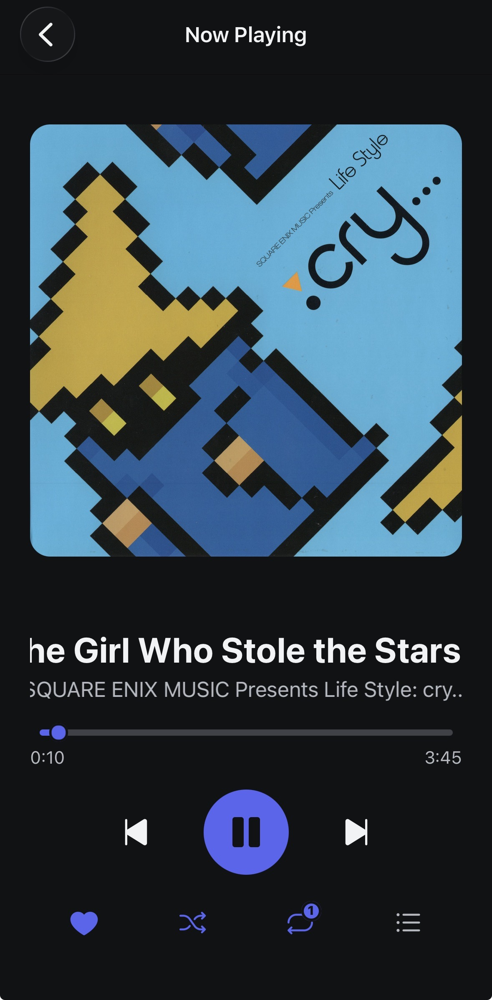 
<b>Figure 25 — SQUARE ENIX MUSIC: cry...</b> "The Girl Who Stole the Stars," shown with the app's blue accent theme.
</td>
</tr></table>

<table><tr>
<td align="center" width="280">
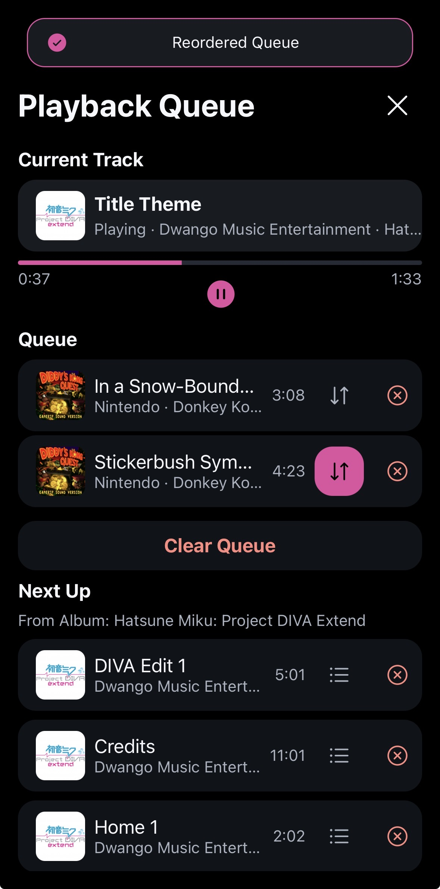 
<b>Figure 26 — Playback Queue</b> Drag-to-reorder queue with a "Reordered Queue" confirmation and an auto-populated Next Up list.
</td>
<td align="center" width="280">
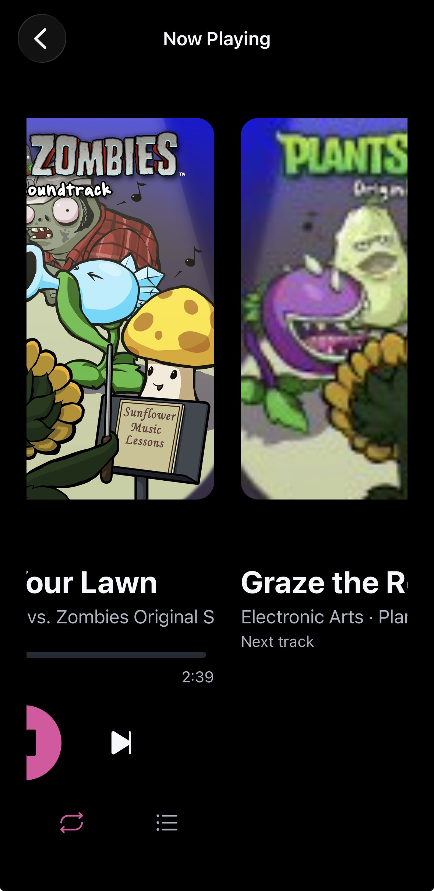 
<b>Figure 27 — Swipe to next track</b> Mid-swipe transition from <i>Plants vs. Zombies</i>' "Zombies on Your Lawn" into "Graze the Roof."
</td>
<td align="center" width="280">
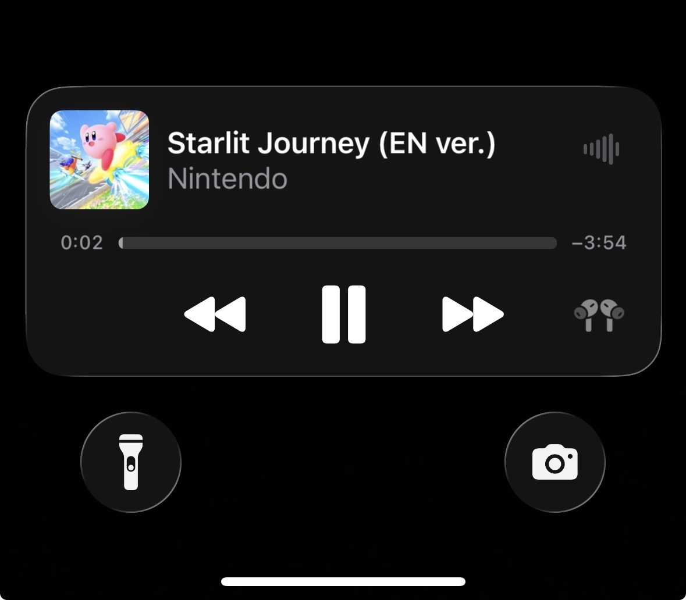 
<b>Figure 28 — Lock screen media controls</b> System-level playback controls while the device is locked.
</td>
</tr></table>

<table><tr>
<td align="center" width="280">
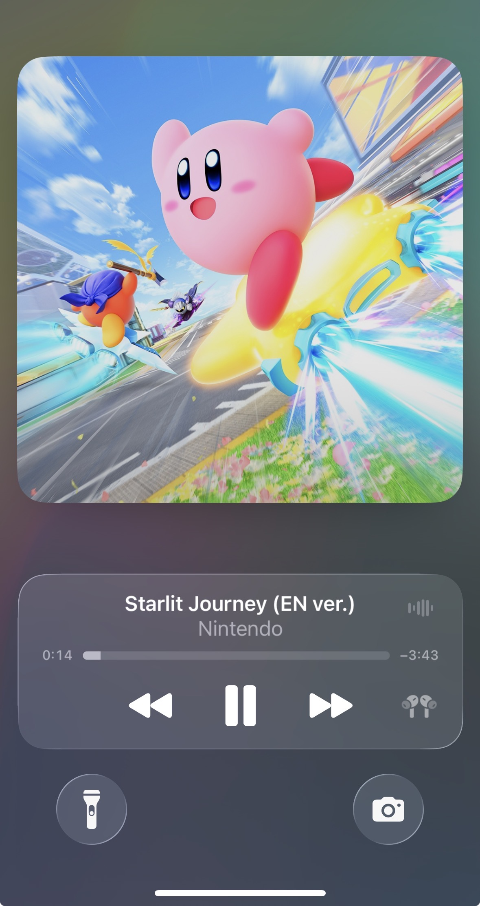 
<b>Figure 29 — Lock screen, full artwork</b> Background playback continuing with full-bleed album art on the lock screen.
</td>
<td align="center" width="280"></td>
<td align="center" width="280"></td>
</tr></table>

<b>The always-visible mini-player (artwork, title/artist, transport controls, compact seek bar) sits beneath every screen — see the bottom of most figures above.</b>

<a href="#vgmu-gallery">↑ back to top</a>

---

## Downloads

<b>Grab tracks or whole albums for offline listening, with per-track control over format and queue state.</b>

<table><tr>
<td align="center" width="280">
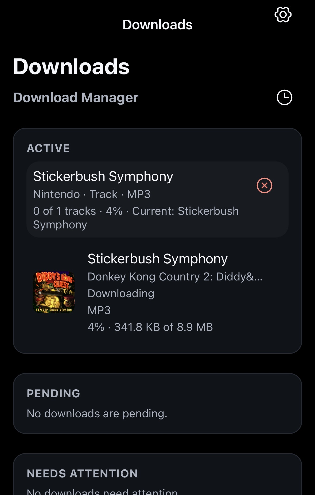 
<b>Figure 30 — Active queue</b> "Stickerbush Symphony" downloading at 4%, with empty Pending and Needs Attention sections.
</td>
<td align="center" width="280">
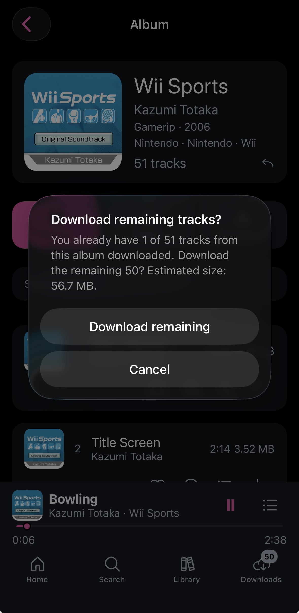 
<b>Figure 31 — Batch download prompt</b> <i>Wii Sports</i> has 1 of 51 tracks saved, with a prompt to grab the remaining 50 (56.7 MB).
</td>
<td align="center" width="280">
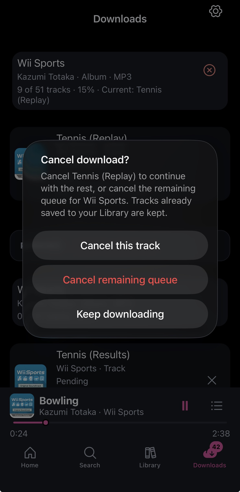 
<b>Figure 32 — Cancel options</b> Mid-batch: cancel just the current track, cancel the whole remaining queue, or keep downloading.
</td>
</tr></table>

<table><tr>
<td align="center" width="280">
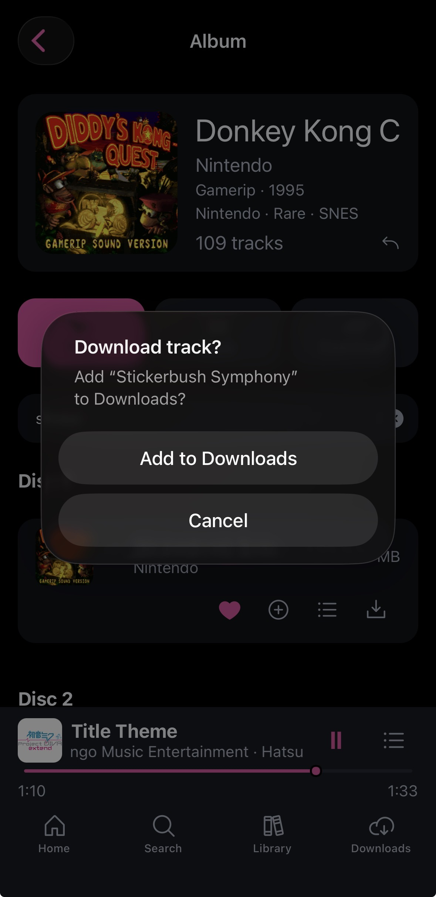 
<b>Figure 33 — Download confirmation</b> Confirming a single-track download from the <i>Donkey Kong Country 2</i> album page.
</td>
<td align="center" width="280">
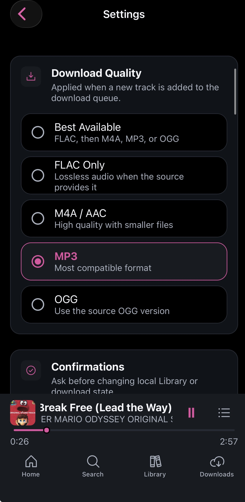 
<b>Figure 34 — Format selection</b> Choosing MP3, alongside Best Available, FLAC Only, M4A/AAC, and OGG.
</td>
<td align="center" width="280">
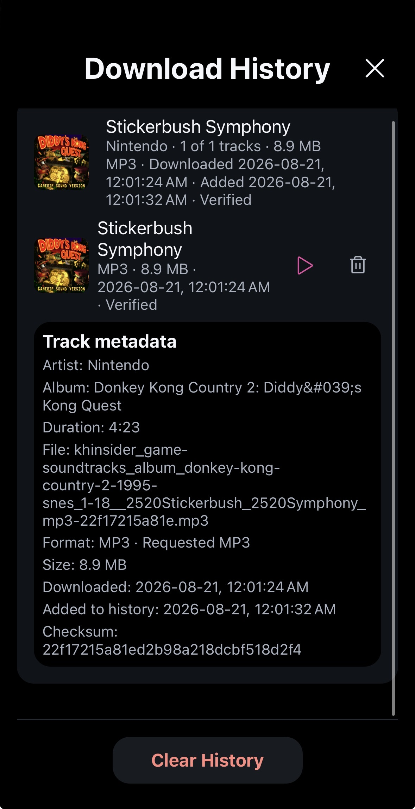 
<b>Figure 35 — Download History detail</b> Full per-track metadata for a verified download — file name, format, size, timestamps, checksum.
</td>
</tr></table>

<a href="#vgmu-gallery">↑ back to top</a>

---

## Settings and Themes

<table><tr>
<td align="center" width="280">
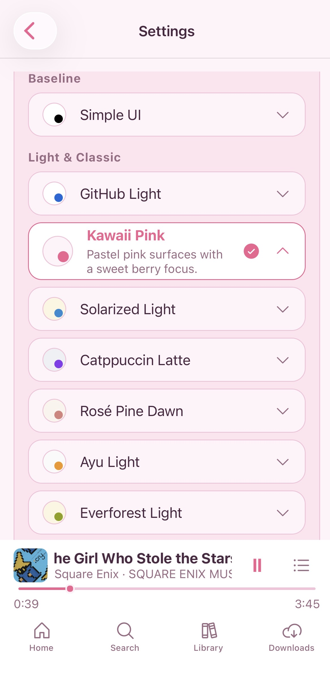 
<b>Figure 36 — Light & Classic theme, Kawaii Pink</b> Pastel surfaces with a sweet berry accent.
</td>
<td align="center" width="280">
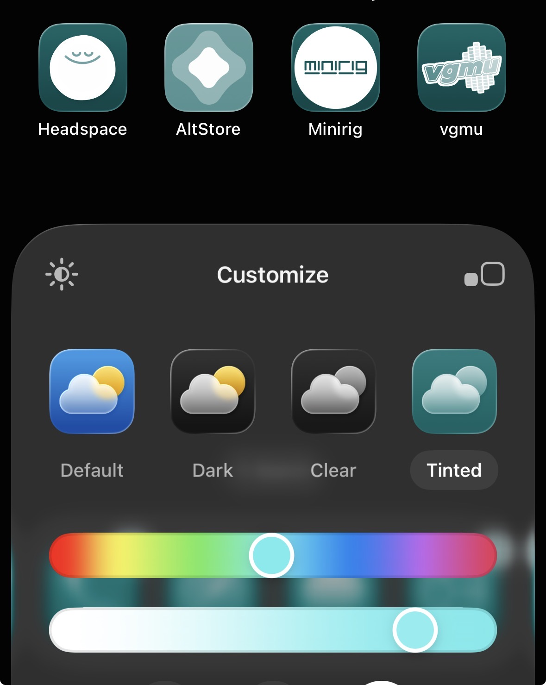 
<b>Figure 37 — iOS icon customization</b> The vgmu Home Screen icon with Default/Dark/Clear/Tinted variants.
</td>
<td align="center" width="280">
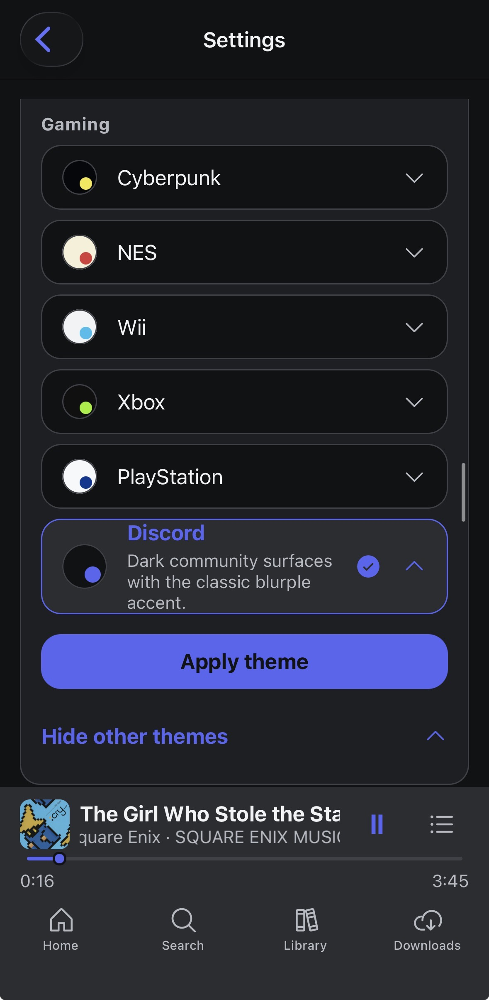 
<b>Figure 38 — Gaming theme, Discord</b> Dark community surfaces with the classic blurple accent.
</td>
</tr></table>

<b>Baseline (Simple UI) with an accent color, or dozens of full fixed-palette presets — Dracula, Nord, Tokyo Night, Catppuccin, Gruvbox, and more — with a live preview before applying.</b>

<table><tr>
<td align="center" width="280">
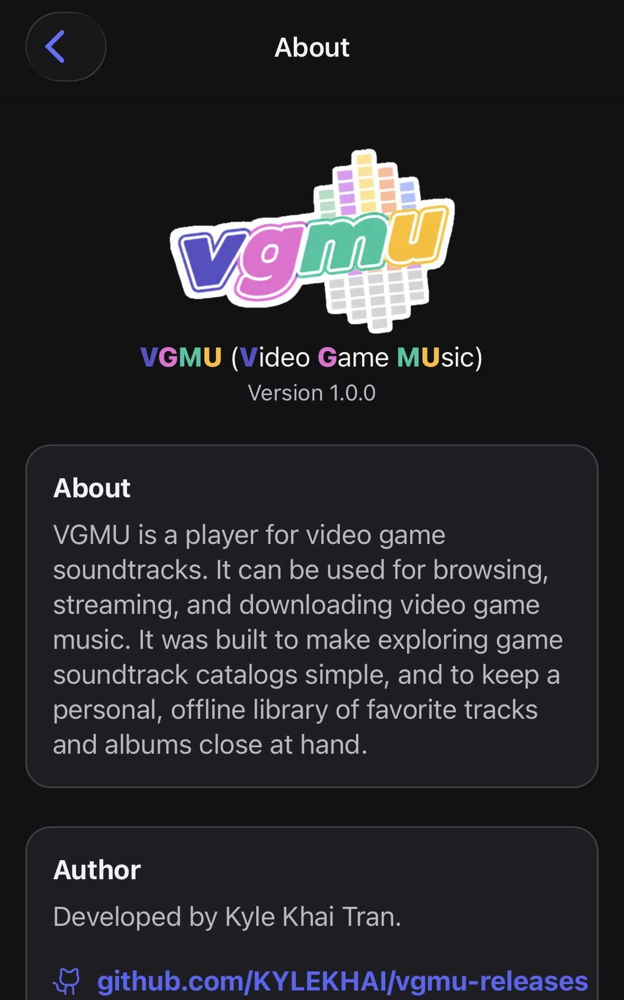 
<b>Figure 39 — About</b> App identity, version, and author info, linking to the GitHub releases repo.
</td>
<td align="center" width="280">
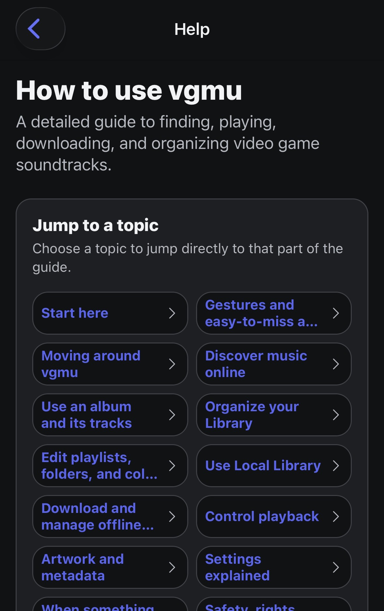 
<b>Figure 40 — Help, "How to use vgmu"</b> The in-app guide's topic index — gestures, discovery, library, downloads, playback, settings, and more.
</td>
<td align="center" width="280"></td>
</tr></table>

<b>Other settings include Default App View, Confirmations, Marquee Scroll Speed, Playlist Artwork behavior, Track Metadata edits, Local Library folder scanning, and Download History retention.</b>

<a href="#vgmu-gallery">↑ back to top</a>

---

## Discord

<b>Optional Rich Presence shows your current track live on your Discord profile, with a matching in-app theme to go with it.</b>

<table><tr>
<td align="center" width="280">
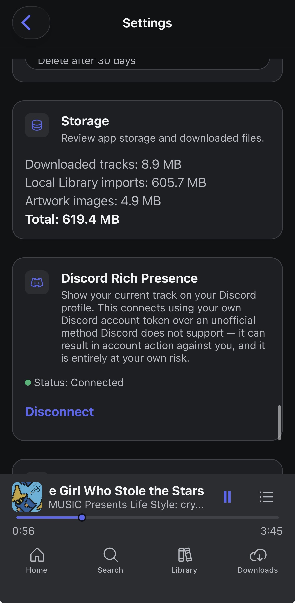 
<b>Figure 41 — Storage breakdown</b> Downloaded tracks, local imports, and artwork by size — 619.4 MB total.
</td>
<td align="center" width="320">
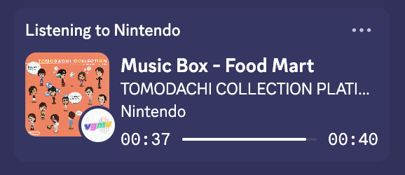 
<b>Figure 42 — Discord profile, Nintendo</b> "Music Box - Food Mart" live on a connected Discord profile.
</td>
<td align="center" width="320">
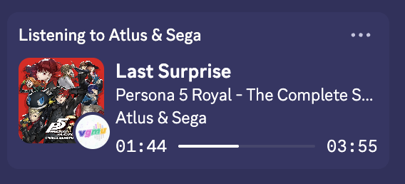 
<b>Figure 43 — Discord profile, Atlus & Sega</b> "Last Surprise" from <i>Persona 5 Royal</i> with a live progress bar.
</td>
</tr></table>

<a href="#vgmu-gallery">↑ back to top</a>

---

Customizable, simple and functional. Download now!

