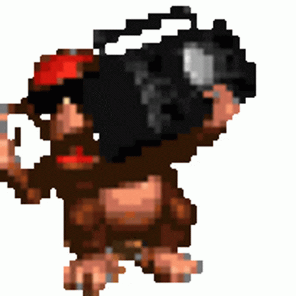

**[README](README.md) · [Installation](docs/INSTALLATION.md) · [Getting Started](docs/GETTING_STARTED.md) · [Usage](docs/USAGE_GUIDE.md) · [Gallery](GALLERY.md) · [Support](SUPPORT.md) · [Security](SECURITY.md) · [Privacy](PRIVACY.md) · [EULA](EULA.md) · [License](LICENSE.md)**

---

# vgmu — mobile vgm music player

♫ An ad-free mobile (Android/iOS) application for video game music on the go! Discover, organize, and enjoy your favourite game soundtracks locally offline or via streaming! No email, accounts or subscription is needed to use the app! ♪

  

---

## Download

- **Current release:** [v1.0.5 — September 8, 2026](https://github.com/KYLEKHAI/vgmu-releases/releases/tag/v1.0.5)
- **Android:** Start with the [APK installation guide](docs/INSTALLATION.md#android).
- **iOS:** Start with the [AltStore Classic self-sideload guide](docs/INSTALLATION.md#ios).
- [Latest GitHub release](https://github.com/KYLEKHAI/vgmu-releases/releases/latest) · [SHA-256 checksums](https://github.com/KYLEKHAI/vgmu-releases/releases/download/v1.0.5/vgmu-1.0.5-SHA256SUMS.txt)

The landing site is built from a separate private repository; its production URL will be added after deployment.

See the [Installation Guide](docs/INSTALLATION.md) for detailed setup instructions.

## Peek Into The App

  
  
  
  
  
  
  
  

Discover soundtracks, search the catalog, build playlists, browse albums, play full-screen, download for offline, customize the look, and show off on Discord — see the full [Gallery](GALLERY.md) for a complete tour of every screen.

## Quick Links

- [Installation Guide](docs/INSTALLATION.md) — How to install vgmu
- [Getting Started Guide](docs/GETTING_STARTED.md) — First steps with vgmu
- [Usage Guide](docs/USAGE_GUIDE.md) — Features and how to use them
- [Gallery](GALLERY.md) — Full screenshot tour of every screen
- [Support & Troubleshooting](SUPPORT.md) — FAQ and common issues
- [Report a Bug](../../issues/new?template=bug_report.md) or [Send Feedback](../../issues/new?template=feedback.md)

## About

vgmu is a personal project for enjoying video game music on mobile. For questions, see [Support](SUPPORT.md).

**Version:** 1.0.5

## ⚠️ Closed Source

**vgmu is closed source.** This repository contains release distribution material, documentation, and user guides. Neither the application source nor the website source is available here. See [LICENSE](LICENSE.md) for details.

**Note:** GitHub source archives (`.zip`, `.tar.gz`) provided below contain public repository files such as documentation; they are neither the application source nor installable binaries.

## Made possible with

Expo, and online video game music archives

  
  

